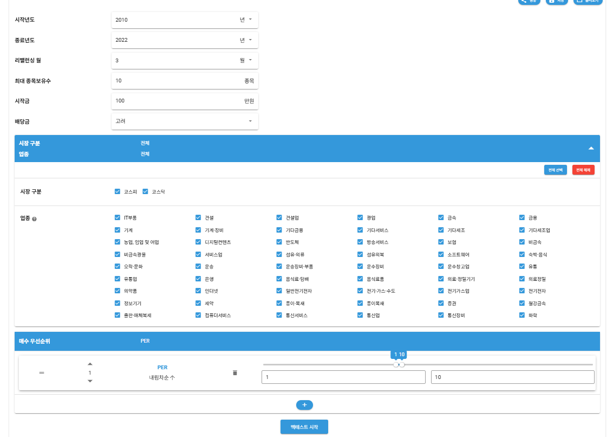
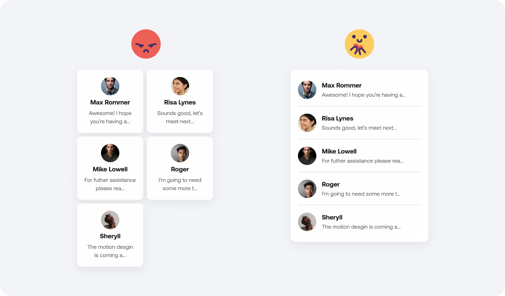

## 기획서 1주차

1. 서비스 목적 - 내가 생각하는 우리 서비스의 궁극적인 목표는 무엇인가요?

    - 주식 비(非)경험자 대상: "안전한 경험과 흥미 유발"
        - 리스크 없는 시뮬레이션: 실제 자금을 투입하지 않고도 "만약 이 시점에 샀다면?"이라는 가정을 통해 투자를 경험해 볼 수 있습니다.
        - 진입 장벽 완화: 주식에 대한 막연한 두려움을 없애고, 게임처럼 전략을 테스트해보며 자연스럽게 흥미를 갖도록 유도합니다.

    - 주식 경험자(투자자) 대상: "전략의 검증과 멘탈 관리"
        - 대외적 증명 (설득의 도구): 기업 가치 분석(기본적 분석) 없이도 차트 기반의 매매 전략(기술적 분석)이 유효하다는 것을 수치로 증명하여 타인을 설득할 수 있는 근거를 제공합니다.
        - 정량적 자기 검증: 본인의 매매 전략이 실제로 수익을 낼 수 있는지 승률과 수익률로 객관적인 판단을 내립니다. (전략의 수정 및 폐기 결정)
        - 심리적 안정(멘탈 케어): 뇌동매매 방지: 흔들리는 장세에서도 검증된 데이터를 믿고 감정을 배제한 기계적 매매를 할 수 있도록 돕습니다.
        - 확신 부여: 전략대로 실행했을 때의 결과를 미리 확인했으므로, 일시적 손실에도 흔들리지 않고 원칙을 고수할 힘을 줍니다.

2. 서비스 타겟 - 내가 생각하는 우리가 만들 서비스의 주요 대상은 누구인가요?

    - 핵심 타겟 (Primary Target): "전략적 매매 입문자 & 시간/용기 부족형 투자자"
        - 대상:
            - 주식을 이미 하고 있지만, 감에 의존한 매매에서 벗어나 자신만의 전략을 갖고 싶어 하는 투자자들.
            - 용기/시간 부족: 내 전략이 맞는지 확신이 없어 실제 돈을 투입하기 두렵거나/직장이나 학업 등으로 인해 일일이 과거 데이터를 돌려보며 검증할 시간이 없는 투자자들.
        - 특징: 이미 완성된 전략으로 잘 벌고 있는 고수들보다는, 이제 막 시스템 트레이딩이나 퀀트적 사고에 관심을 갖기 시작한 층입니다.

    - 확장 타겟 (Secondary Target): "게이미피케이션(Gamification)을 즐기는 잠재 투자자"
        - 대상: 주식을 하지 않거나 잘 모르는 일반인.
        - 유입 요소:
            - 파라미터 놀이: 복잡한 수식 대신, 몇 가지 설정(파라미터)만 조작하여 "최고의 승률/수익률"을 찾아내는 과정을 게임처럼 즐김.
        - 특징: 경쟁 심리 (리더보드): "누가 만든 전략이 수익률 1등인가?"를 보여주는 랭킹 시스템을 통해 흥미를 유발하고 자연스럽게 주식 시장에 관심을 갖게 함.

3. 서비스 핵심 가치 - 내가 생각하는 우리가 만들 서비스가 추구해야 할 핵심 가치는?

    - AI 기반의 극대화된 접근성 (Accessibility)
        - 자연어 인터페이스: 복잡한 수식 입력 대신, "어떤 전략으로 언제부터 언제까지 테스트해줘"라고 말하면 AI가 이를 알아듣고 처리합니다.
        - 프롬프트 엔지니어링의 중요성: 사용자의 모호한 자연어를 백테스팅 엔진이 이해할 수 있는 정확한 파라미터(변수) 값으로 변환하는 것이 핵심 기술이자 가치입니다.

    - 투명성을 통한 교육적 가치 (Transparency & Education)
        - Black Box 지양: AI가 설정한 파라미터를 숨기지 않고 사용자에게 그대로 보여줍니다.
        - 사용자별 효용:
            - 초보자: "내 말이 이런 수치로 변환되는구나"를 보며 매매 로직을 학습.
            - 숙련자: AI의 해석이 의도와 맞는지 검증하고, 미세 조정(Fine-tuning)을 통해 전략을 수정.

    - 사용자 편의성과 경험 (UX/UI & Performance)
        - 전략 보관 및 비교: 여러 전략을 저장해두고, 성과를 한눈에 비교 분석할 수 있는 기능을 제공합니다.
        - 비동기 처리(Asynchronous Processing): 백테스팅 연산이 느릴 경우를 대비해, 로직 실행과 UI 동작을 분리합니다. 테스트가 돌아가는 동안 사용자는 멍하니 기다리지 않고 다른 전략을 수정하거나 살펴볼 수 있어야 합니다.

    - 정확성 (Accuracy)
        - 백테스팅 결과의 신뢰도는 기본이며, AI가 사용자의 의도를 왜곡하지 않고 정확한 파라미터로 매핑하는 것이 '정확성'의 새로운 척도가 됩니다.

4. PainPoint/Wowpoint - 우리가 만들 서비스가 의미가 있기 위해서는 기존의 문제를 해결하는 차별화가 있어야겠죠? 기존 사람들은 목적을 달성하기 위해서 어떤 서비스와 단계들을 이용해서 해결하고 있는지 생각해보고 무엇이 우리가 만들 서비스의 경쟁력이 되어줄 지 생각해봅시다! (AS-IS: 기존 사람들은 목적을 달성하기 위해서 어떤 서비스와 단계들을 이용해서 해결하고 있는가? Pain Point: 여기에서 어떤 아쉬운 점이 있고 무엇이 기회인가?)

    - 주식 비(非)경험자 (General Public)
        - Pain Point (문제점):
            - 실천의 부재: 유튜브 등으로 정보는 접하지만, '내 돈을 잃을까 봐' 두려워 실제 투자로 이어지지 않음.
            - 무관심: 투자가 어렵고 복잡하다고 느껴 아예 시도조차 하지 않음.
        - Wow Point (해결책):
            - Risk-Free Experience: 돈 한 푼 들이지 않고 내 생각이 맞는지 확인해보는 '모의 실험' 경험 제공.
            - 흥미 유발: 투자를 공부가 아닌 게임이나 실험처럼 접근하게 하여 잠재적 투자자로 전환.

    - 주식 경험자 (Investors)
        - Pain Point (문제점):
            - 코딩의 장벽 (The Coding Barrier): '트레이딩뷰(TradingView)'나 '파이썬(Python)' 등 기존 툴은 코딩(Pine Script 등)을 할 줄 알아야만 정교한 백테스팅이 가능함.
            - 노가다 (Manual Labor): 코딩을 못 하는 대다수의 투자자는 과거 차트를 일일이 눈으로 확인(Eye-balling)하며 수동으로 검증해야 해서 시간이 오래 걸리고 부정확함.
        - Wow Point (해결책):
            - No-Code, AI Interface: 복잡한 코딩 없이 자연어(말)로 전략을 설명하면 AI가 알아서 검증해 줌.
            - 대중화: 소수의 퀀트나 개발자만 누리던 '데이터 기반 검증'의 영역을 일반 개인 투자자에게까지 확장.

5. 의심하고 질문 만들기

    - 우리의 Wow Point가 있다면 고객이 뭘 어떻게 하게 될까? (행동 변화)
        - 바이럴 및 확산: 쉽고 재미있기 때문에(리더보드 등 게이미피케이션) 입소문을 내고 서로 공유할 것이다.
        - 관심의 확장: 주식을 안 하던 사람들도 재미로 시작했다가 경제 정책이나 시장 흐름에 관심을 갖게 된다.
        - 심리적 무장 (Mindset): 투자자들이 백테스팅 결과를 믿고, 하락장이나 뇌동매매의 유혹 속에서도 자신의 전략을 고수하여 결국 수익률을 개선하게 된다.

    - 그러기 위해서는 우리는 어떤 전제를 하고 있었나?
        - 신뢰성 전제: "백테스팅 결과와 실제 매매 결과의 오차가 적을 것이다" (사용자가 믿고 쓸 수 있는 수준).
        - 재미 전제: "사람들이 유튜브나 게임 대신 이걸 할 만큼 재미있을 것이다" (단순 정보 제공 이상이어야 함).
        - 기술적 전제 (데이터): 과거 데이터 및 현재 주가를 즉시 불러와 대입할 수 있는 API가 존재한다.
        - 기술적 전제 (로직): 단순 수치(5% 수익)뿐만 아니라, 추상적인 개념(골든크로스 등)도 파라미터화하여 로직으로 구현 가능하다.

    - 그런데 진짜 그럴까? 질문 만들기
        - 재미에 대한 의심: 세상에 재밌는 게 너무 많은데, 속도가 느리거나 UI가 조금만 불편해도 사용자가 이탈하지 않을까? (순수 재미만으로 경쟁이 가능한가?)
        - 구현 가능성 의심: "5% 익절"은 쉽지만, "골든크로스 때 매수" 같은 복잡하고 모호한 전략을 AI와 백테스팅 엔진이 정말 완벽하게 처리할 수 있을까?
        - 데이터 접근성 의심: 우리가 원하는 수준의 주가 데이터를 제공하는 API를 실제로 확보(연동)할 수 있는가?

6. "어떻게 하면 ~" 질문 만들고 "그래서 무엇을 어떻게 만들어야 할까?"는 기능적인 귀결로 답하기

    - 공유와 관찰
        - Q. "어떻게 하면 다른 사람들이 만든 전략을 볼 수 있게 할까?"
            - 기능: 전략 리더보드 (Ranking) / 전략 탐색 페이지 (공개된 전략 리스트업).
        - Q. "어떻게 하면 내가 만든 전략들을 한곳에 모아서 볼 수 있을까?"
            - 기능: 마이 페이지 (대시보드) / 전략 보관함 (라이브러리).

    - 데이터와 파라미터
        - Q. "어떻게 하면 파라미터들을 다양하게 지원할 수 있을까?"
            - 기능: 지표 선택 옵션 다양화 (단순 가격 외 보조지표 추가).
        - Q. "어떻게 하면 페이지가 무거워지지 않으면서 지표를 제공할까? (기업 고유값 크롤링 이슈)"
            - 기능: 기술적 지표(Technical Indicators) 우선 도입. (재무제표 등 무거운 데이터 대신 차트 데이터로 계산 가능한 RSI, 이동평균선 등에 집중).
        - Q. "어떻게 하면 트레이딩뷰처럼 많은 차트 파라미터를 우선적으로 넣을까?"
            - 기능: TA-Lib 같은 라이브러리를 활용해 표준화된 기술적 지표 셋(Set) 구축.

    - 분류와 관리
        - Q. "어떻게 하면 쌓여가는 전략들을 잘 분류(카테고라이징)할 수 있을까?"
            - 기능: 태그(Tag) 시스템 (#단타, #스윙, #돌파매매) 또는 폴더링 기능.

    - AI와 로직
        - Q. "어떻게 하면 AI가 기억을 유지하면서 소통하게 할 이유를 만들까? (대화의 연속성)"
            - 기능: 멀티턴(Multi-turn) 대화 지원. (앞선 전략을 수정하거나 발전시키는 '빌드업' 과정 지원).
        - Q. "어떻게 하면 논리적으로 계산을 정확하고 빠르게 할 수 있을까?"
            - 기능: 백테스팅 엔진 최적화 (벡터 연산) 및 서버 부하 분산 처리.

    - 보상과 재미 (사용자 심리)
        - Q. "어떻게 하면 사용자가 원하는 보상을 줄 수 있을까?"
            - 기능: 시각적 이펙트(Effect) (폭죽, 상승 그래프 애니메이션) / 공간(Space) 제공 (명예의 전당 등).
        - Q. "어떻게 하면 사용자가 재미를 느끼게 할까?"
            - 기능: 게이미피케이션 (레벨업, 뱃지, 수익률 대결).

    - 확장과 유입 (마케팅적 사고)
        - Q. "어떻게 하면 유입을 많이 시킬 수 있을까?"
            - 기능: SNS 공유 기능 (내 수익률 카드 만들기), 친구 초대 시 혜택.

    - 사용자 편의
        - Q. "어떻게 하면 사용자가 무엇을 원하는지 더 잘 파악할까?"
            - 기능: 직관적인 UI/UX, AI가 역으로 질문하기("손절 라인은 -5%로 잡을까요?").

7. Key Feature Story - 이번 스프린트에서 어떤 문제를 핵심적으로 풀어야겠는가? wow point와 의심을 검증할 수 있는 핵심 flow의 범위를 좁히는 것도 중요함

    - 백테스팅 엔진의 기술적 검증 (Technical Validation)
        - 데이터 커버리지: 과거 데이터를 어느 기간까지 조회해서 대입할 수 있는가?
        - 파라미터 수용력: 사용자의 복잡한 요구(파라미터)를 빠짐없이 로직에 반영할 수 있는가?
        - 속도 (Performance): 사용자가 이탈하지 않을 만큼 빠른 속도로 결과가 나오는가?
        - 데이터 정확성: 결과값이 믿을만한가?

    - 전략 저장 및 비교 (Strategy Management)
        - 가시성 확보: 전략들이 무작위로 나열되면 보기 힘드므로, 정렬(Sorting) 기능이 필수입니다.
        - 정렬 기준: 우선적으로 수익률(승률) 기준 내림차순 정렬을 도입하여, 어떤 전략이 좋은지 한눈에 보이게 합니다.

    - 정보 투명성 및 공개 범위 (Transparency Policy)
        - 파라미터(필수 공개): 구체적인 세부 설정값(수치 등)은 투명하게 공개합니다.
        - LLM 대화 로그(비공개): AI와 나눈 대화 내역까지 보여줄 필요는 없습니다.
        - 사용자 설명: 대신, 사용자가 직접 작성한 전략 설명(Description)을 보여주어 의도를 전달합니다.

    - 범위 좁히기 (De-scoping)
        - DB 동시성/무결성 이슈: (말씀하신 'TV'는 DB를 의미하신 것으로 보입니다) 리더보드는 데이터를 '읽기(Read)'만 하는 영역이므로, 복잡한 트랜잭션 동시성(Concurrency) 관리까지는 이번 단계에서 고민하지 않고 단순 조회 구현에 집중합니다.

8. 기능 나열하기 - 이 서비스에는 이런 기능 요소들이 있을 것 같아요! 사용자 중심보다는, 우리가 만들 서비스의 어떤 기능이 고객의 어려움을 해결할 지 생각해보기

    - 핵심 기능: 전략 수립 및 백테스팅 (The Core)
        - AI 자연어 파라미터 설정 (Main):
            - 사용자가 자연어로 전략을 말하면, AI가 이를 해석해 백테스팅 엔진이 이해할 수 있는 파라미터 값으로 자동 변환해 줍니다. (초보자용)
        - 파라미터 직접 설정 (Expert Mode):
            - 이미 지식이 있는 사용자가 세부 값을 직접 수정하고 튜닝할 수 있는 인터페이스를 제공합니다. (숙련자용)

    - 저장 및 소셜 기능 (Storage & Social)
        - 나만의 전략 보관함:
            - 내가 만든 전략을 저장하고 언제든 다시 꺼내볼 수 있습니다.
        - 전략 공유 및 리더보드:
            - 다른 사람들의 전략을 열람하고 참고할 수 있습니다.
            - 정렬 기준:
                - 수익률 순: 정량적인 퍼포먼스 비교.
                - 좋아요 순: "실전에서도 괜찮았다"는 커뮤니티의 신뢰도(검증) 지표로 활용.
        - 전략 설명:
            - LLM과의 대화 로그 전체보다는, 사용자가 직접 작성한 '전략 설명글'과 '설정된 파라미터'를 투명하게 공개합니다.

    - AI 심층 분석 및 회고 (AI Insight & Review)
        - 백테스팅 결과 원인 분석:
            - 단순히 "수익률 -10%"만 보여주는 것이 아니라, 결과를 다시 LLM에게 보내 "왜 망했는지(혹은 성공했는지)" 분석을 요청합니다.
        - 거시/미시 요인 구분:
            - AI가 해당 기간의 거시 경제 지표(금리, 뉴스 등)와 기술적 요인(차트)을 종합하여, "이 전략은 로직은 좋았으나 당시 시장 폭락장(거시 요인) 때문에 실패했습니다"와 같은 구체적인 피드백을 제공합니다.

9. 페이지 나누기 - 대략적인 페이지와 기능을 나누어보아요. 발산한 이야기들이 자연스럽게 수렴되는 단계. 사용자 경험/콘텐츠 유형/기능과 목적에 따라 나눠보기.

    - 백테스팅 페이지 (Main Workspace)
        - 목적: 전략 수립 및 검증 (핵심 기능).
        - 주요 구성 요소:
            - 입력부:
                - LLM 채팅창: 자연어로 전략을 입력하고 수정하는 공간.
                - 파라미터 패널: 설정된 변수들이 표시되고, 수동으로 조작 가능한 영역.
            - 결과부 (Dashboard):
                - 핵심 지표: 수익률(ROI), 승률(Win Rate), 최대 손실률(MDD), 최고 승률 등.
                - 상세 데이터: 시각적 시뮬레이션 대신 '매매 내역 CSV 다운로드' 기능 제공 (날짜, 종목, 매수/매도액 등 포함).

    - 나의 전략 보관함 (My Dashboard)
        - 목적: 내가 만든 전략의 저장, 관리, 심층 분석.
        - UI/UX: 카드(Card) 형태의 레이아웃.
        - 카드 구성:
            - 미리보기 (Front): 전략 이름, 간략 설명, 핵심 지표(수익률, MDD).
            - 상세보기 (Detail): 클릭 시 확장. 세부 파라미터 전체, 전체 설명글.
        - 특화 기능: AI 심층 분석 (On-Demand)
            - 작동 방식: 처음엔 비어있음 → 사용자가 "이 결과 분석해줘"라고 요청(프롬프트) → AI가 결과와 파라미터를 분석해 인사이트를 채워줌. (플레이스홀더 처리)

    - 전략 리더보드 (Community & Ranking)
        - 목적: 게이미피케이션, 전략 공유, 트렌드 확인.
            - UI/UX: 랭킹 리스트 및 카드형 피드 혼합.
        - 정렬/필터(Sorting & Filtering):
            - 정렬: 수익률순, 좋아요순(신뢰도 척도), 최신순.
            - 기간 필터:
                - 공정성 확보: 단순히 "상승장 1년"만 테스트한 전략이 1등 하는 것을 방지.
                - 제약: "최소 3년 이상" 또는 "하락장 포함" 등 절대적 날짜 기간을 기준으로 필터링하여 '진짜 실력'을 겨루도록 유도.

10. 해당 기능으로 우리의 대상이 궁극적인 목표를 해결할 수 있는지 여정을 self-점검해보세요.

    - 진입 및 유도 (Onboarding):
        - 메인 페이지 접속 시, 복잡한 차트 대신 "AI에게 말 걸기" 버튼이 가장 눈에 띄어 자연스럽게 클릭합니다.
    - 전략 수립 (Creation):
        - "골든크로스 때 사서 5% 먹고 싶어"라고 자연어로 입력합니다.
        - AI가 이를 파라미터로 변환해주고, [백테스팅 시작]을 누르면 결과가 출력됩니다.
    - 저장 및 아카이빙 (Save):
        - 결과가 마음에 들거나 기록하고 싶어, 간단한 설명을 적고 [저장하기]를 누릅니다.
        - '나의 보관함'으로 이동하여 방금 만든 전략이 카드 형태로 생성된 것을 확인합니다.
    - 심층 학습 (Insight):
        - 카드를 눌러 상세 페이지로 진입 후, [AI 요약/분석] 버튼을 클릭합니다.
        - "이 전략은 좋았으나 당시 거시 경제 악화로 수익률이 낮았다"는 식의 피드백을 받고 학습합니다.
    - 확장 및 경쟁 (Social):
        - 자신감이 생겨 **[리더보드 등록]**을 합니다.
        - 내 순위를 확인하고, 상위권 랭커들의 전략(수익률, 좋아요)을 구경하며 새로운 아이디어를 얻습니다.
    - 반복 및 발전 (Iteration):
        - 다른 사람의 전략을 참고하여 다시 메인 페이지로 돌아옵니다.
        - 기존 전략을 수정(Tuning)하거나 새로운 전략을 실험하며 실력을 키워나갑니다.

11. 간단 스케치 (그림을 못 그려서 레퍼런스로 대체)

